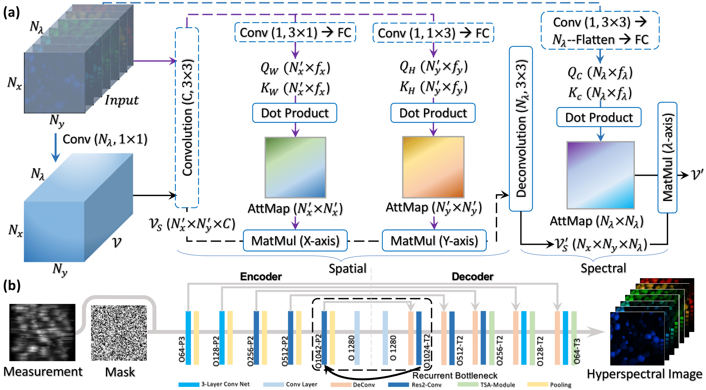

# TSA-Net for CASSI
This repository contains the codes for paper **End-to-End Low Cost Compressive Spectral Imaging with Spatial-Spectral Self-Attention** (***ECCV (2020)***) by [Ziyi Meng*](https://github.com/mengziyi64), [Jiawei Ma*](https://github.com/Phoenix-V), [Xin Yuan](https://www.bell-labs.com/usr/x.yuan) (*Equal contributions). [[pdf]]()  
We provide simulation data and real data of our system. You can download them by the following link.  
[[Simu data (Google Drive)]](https://drive.google.com/drive/folders/1BNwkGHyVO-qByXj69aCf4SWfEsOB61J-?usp=sharing), [[Simu data (One Drive)]](https://1drv.ms/u/s!Au_cHqZBKiu2gYFDwE-7z1fzeWCRDA?e=ofvwrD), [[Simu data (Baidu Drive pw:aw5u)]](https://pan.baidu.com/s/1kWeH0IsHdj7Pbdd5oCJqTA)  
[[Real data (Google Drive)]](https://drive.google.com/drive/folders/1A3529q8G5TFg1LHaPTHp3-gyjOIbn6Ki?usp=sharing), [[Real data (One Drive)]](https://1drv.ms/u/s!Au_cHqZBKiu2gYFTpCwLdTi_eSw6ww?e=uiEToT), [[Real data (Baidu Drive pw:8n9x)]](https://pan.baidu.com/s/1k0khhPytcbKTb0G5NsaFCw) 


## Overviewer
Coded aperture snapshot spectral imaging ([CASSI](https://www.osapublishing.org/ao/abstract.cfm?uri=ao-47-10-B44)) is an effective tool to capture real-world 3D hyperspectral images. We have proposed a Spatial-Spectral Self-Attention module to jointly model the spatial and spectral correlation in an order-independent manner, which is incorporated in an encoder-decoder network to achieve high quality reconstruction for CASSI.

<p align="center">

</p>
Fig. 1 (a) Single disperser coded aperture snapshot spectral imaging (SD-CASSI) and our experimental prototype. (b) 25 (out of 28) reconstructed spectral channels. (c) Principle of hardware coding.

## TSA-Net Architecture
<p align="center">

</p>
Fig. 2 (a) Spatial-Spectral Self-Attention (TSA) for one V feature (head). The spatial correlation involves the modelling for x-axis and y-axis separately and aggregation in an order-independent manner: the input is mapped to Q and K for each dimension: the size of kernel and feature are specified individually. The spectral correlation modelling will flatten samples in one spectral channel (2D plane) as a feature vector. The operation in dashed box denotes the network structure is shared while trained in parallel. (b)
TSA-Net Architecture. Each convolution layer adopts a 3 x 3 operator with stride 1 and outputs O-channel cube. The size of pooling and upsampling is P and T.

<p align="center">

</p>
Fig. 3 A reconstructed hyperspectral video.

## Usage
### Download the SMEM repository and model file
0. Requirements are Python 3 and Tensorflow 1.13.
1. Download this repository via git
```
git clone https://github.com/mengziyi64/TSA-Net
```
or download the [zip file](https://github.com/mengziyi64/TSA-Net/archive/master.zip) manually.

3. Download the model file  
Simulation model(0.97 GB): via [Google Drive](https://drive.google.com/drive/folders/1FrtEndhzaJoFxvnVT7tKW-Rc1RtOxgcp?usp=sharing) or [One Drive](https://1drv.ms/u/s!Au_cHqZBKiu2gYFBE6Rvvgu0JtayNw?e=oQceKJ) or [Baidu Drive (pw:cskg)](https://pan.baidu.com/s/1kah_U8VP8rskhn710DoV3g) and put the file into path 'TSA_Net_simulation/Result/Model-Condig/TSA-Model/'.  
Real data model(1.30 GB): via [Google Drive](https://drive.google.com/drive/folders/1IG_45bmiqk1hHgD0549xyO-Zrgy0eASy?usp=sharing) or [One Drive](https://1drv.ms/u/s!Au_cHqZBKiu2gYFUWgiG5qGP48Fh_w?e=hWWyd8) or [Baidu Drive (pw:iubr)](https://pan.baidu.com/s/1iQgcnDQpO7mU2U00WRBu7g) and put the file into path 'TSA_Net_realdata/Result/Model-Condig/TSA-Model-Real/'.

### Testing 
1. Testing on simulation data   
Run **TSA_Net_simulation/test.py** to reconstruct 10 synthetic datasets. The results will be saved in 'TSA_Net_simulation/Result/Testing-Result/' in the MatFile format.  
2. Testing on real data   
Run **TSA_Net_realdata/test.py** to reconstruct 5 real datasets. The results will be saved in 'TSA_Net_realdata/Result/Testing-Result/' in the MatFile format.  

### Training 
1. Training simulation model
    1) Put hyperspectral datasets (Ground truth) into corrsponding path, i.e., 'TSA_Net_simulation/Data/Training_truth/' for training data and 'TSA_Net_simulation/Data/Valid_truth/' for validation data. For our setting, the training data and validation datashould be scaled to 0-65535 and 0-1, respectively, with a size of 256×256×28.  
    2) Adjust training parameter by modify **TSA_Net_simulation/Model/Config.yaml**.
    3) Run **TSA_Net_simulation/train.py**.
2. Training real data model  
    1) Put hyperspectral datasets (Ground truth) into corrsponding path, i.e., 'TSA_Net_realdata/Data/Training_truth/' for training data and 'TSA_Net_realdata/Data/Valid_truth/' for validation data. For our setting, the training data and validation datashould be scaled to 0-1 with a size of 660×660×28.  
    2) Adjust training parameter by modify **TSA_Net_realdata/Model/Config.yaml**.
    3) Run **TSA_Net_realdata/train.py**.


## Contact
Ziyi Meng, Beijing University of Posts and Telecommunications, Email: mengziyi@bupt.edu.cn, zm233@njit.edu
Jiawei Ma, Columbia University, Email: jiawei.m@columbia.edu
Xin Yuan, Bell Labs, Email: xyuan@bell-labs.com
